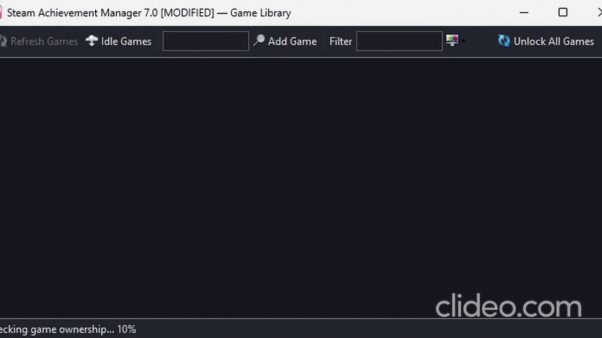
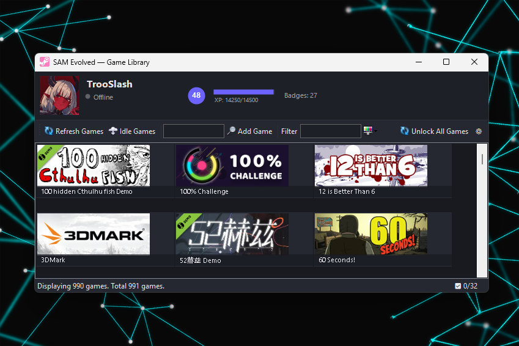
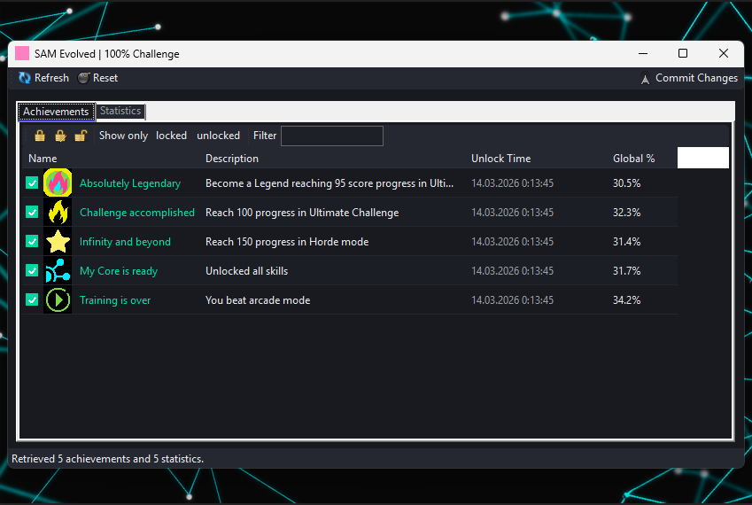
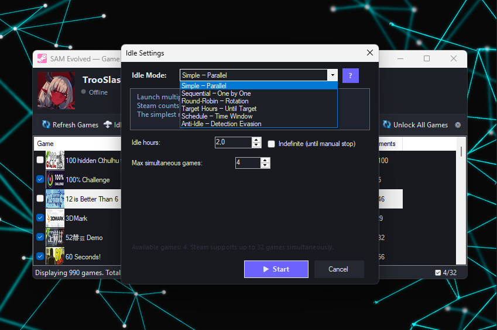
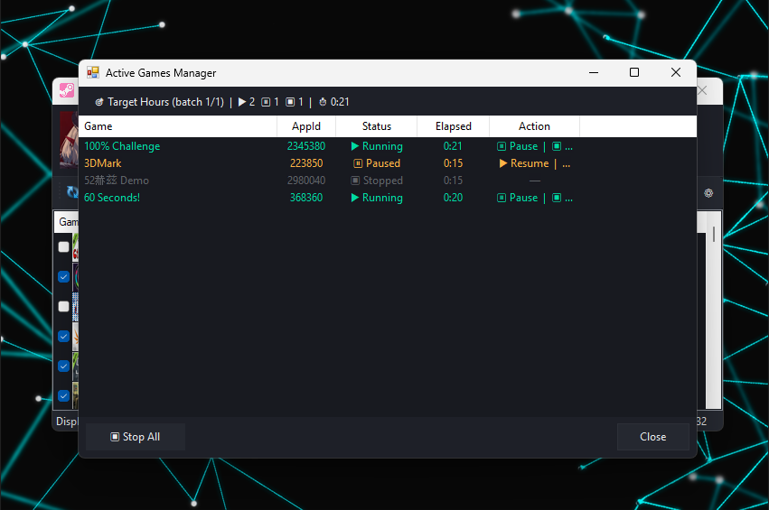

# Steam Achievement Manager 7.0 [MODIFIED]

**[EN](README.md)** | **[RU](README.ru.md)**

Глубоко переработанная версия [Steam Achievement Manager](https://github.com/gibbed/SteamAchievementManager) от gibbed. Добавлена тёмная тема, режимы простоя, локализация, отображение наигранного времени и множество улучшений. Полная совместимость с оригинальным Steam API.

[](https://github.com/TrooSlash/SteamAchievementManager-7.0.40-MODIFIED/releases/latest)

---

## Содержание

- [Требования](#требования)
- [Сборка](#сборка)
- [Отличия от оригинала](#отличия-от-оригинала)
- [Описание функций](#описание-функций)
- [Аргументы командной строки](#аргументы-командной-строки)
- [Структура проекта](#структура-проекта)
- [Скриншоты](#скриншоты)

---

## Требования

- Windows 7 и выше
- .NET Framework 4.8
- Steam клиент (запущен, пользователь авторизован)
- Платформа: x86 (32-bit)

## Сборка

```
dotnet build SAM.sln -c Release -p:Platform=x86
```

Результат: `upload\SAM.Picker.exe`, `upload\SAM.Game.exe`

---

## Отличия от оригинала

### Новые функции

| Функция | Описание |
|---------|----------|
| **6 режимов Idle** | Simple, Sequential, Round-Robin, Target Hours, Schedule, Anti-Idle -- единый диалог настройки |
| **Менеджер активных игр** | Окно мониторинга с паузой, возобновлением и остановкой каждой игры |
| **Отображение времени** | Наигранные часы и дата последнего запуска из локальных файлов Steam (без API ключа) |
| **Плитка / Список** | Переключение между карточками и таблицей с сортируемыми столбцами |
| **Пакетный выбор** | Чекбоксы в режиме списка для выбора до 32 игр |
| **Локализация** | Английский и русский интерфейс с переключением в реальном времени |
| **Диалог настроек** | Единое окно для выбора языка и режима отображения |
| **Кэширование иконок** | Обложки игр загружаются один раз и хранятся в памяти |
| **Корректное завершение Idle** | Сигнал через EventWaitHandle -- чистое отключение от SteamAPI вместо убийства процесса |
| **Очистка манифестов** | Автоматическое удаление пустых файлов appmanifest_*.acf после idle |
| **Пакетная разблокировка** | Аргумент `--unlock-all` для разблокировки всех достижений без GUI |

### Переработка интерфейса

Тёмная тема оформления для всех окон приложения:

| Элемент | Цвет |
|---------|------|
| Фон | #181A20 |
| Поверхность | #1E2028 |
| Панель инструментов | #252830 |
| Акцент | #6C63FF |
| Вторичный акцент | #00D9A3 |
| Текст | #E8EAED |
| Вторичный текст | #9AA0A6 |
| Выделение | #2E2B4A |

Применено ко всем окнам (выбор игры и редактор достижений):
- Кастомная отрисовка OwnerDraw для элементов ListView (игры и достижения)
- Тёмный TabControl с акцентной линией на активной вкладке
- Тёмные панели инструментов, строки состояния, контекстные меню и диалоги
- Чередование цвета строк в списках
- Кастомные чекбоксы (без зелёных подсветок WinForms)

### Исправления и улучшения

| Область | Изменение |
|---------|-----------|
| **Производительность** | Отложенная загрузка URL изображений -- экономит ~3000 нативных IPC вызовов при старте |
| **Индикатор прогресса** | Строка состояния показывает "Checking game ownership... N%" |
| **Краш BeginInvoke** | Добавлена проверка `IsHandleCreated` перед межпоточными вызовами |
| **Обработка ошибок** | `catch(Exception)` при загрузке достижений предотвращает тихие падения |
| **Вкладка статистик** | Автоматически скрывается если у игры 0 статистик |
| **Сортировка столбцов** | Клик по заголовку переключает направление, стрелка-индикатор |
| **Иконки достижений** | Уменьшены с 64x64 до 32x32 для компактного отображения |
| **Рамки ListView** | Убраны нативные 3D-рамки |
| **Рамки TabControl** | Закрашены нативные рамки вкладок |
| **Защищённые достижения** | Тёмно-красный фон (#281919) для неизменяемых достижений |
| **Потокобезопасность** | Thread-safe HashSet для параллельной загрузки иконок |
| **Память** | Корректное освобождение WebClient и Bitmap |

### Без изменений

- **SAM.API** -- Весь слой Steam API не тронут. Нативный interop, vtable-вызовы и управление pipe идентичны оригиналу.
- **Обнаружение игр** -- Перечисление, проверка владения и получение данных игр без изменений.
- **Чтение/запись достижений** -- Вызовы `SetAchievement`, `GetAchievement` и `StoreStats` -- оригинальный код.

---

## Описание функций

### Режимы Idle

Шесть режимов через кнопку Idle Games на панели инструментов:

| Режим | Описание |
|-------|----------|
| **Simple** | Запуск всех выбранных игр одновременно. Опциональный лимит часов. |
| **Sequential** | Запуск игр по одной, каждая на заданное количество часов. |
| **Round-Robin** | Ротация между играми с настраиваемым интервалом (минуты). |
| **Target Hours** | Работа пока каждая игра не достигнет целевого времени. |
| **Schedule** | Работа только в заданные часы (например, 02:00 -- 08:00). |
| **Anti-Idle** | Периодический перезапуск процессов для предотвращения таймаута Steam. |

Если ни одна игра не отмечена чекбоксом -- используются все отображаемые игры. Максимум 32 игры за сессию (ограничение Steam).

### Менеджер активных игр

Отдельное окно при запуске idle-сессий:

- Список всех запущенных idle-процессов в реальном времени
- Управление каждой игрой: Пауза / Возобновление / Стоп
- Счётчик времени для каждой игры
- Кнопка "Остановить все" с подтверждением
- Корректное завершение через именованные события, с откатом к kill через 3 секунды
- Очистка осиротевших манифестов Steam при закрытии

### Режимы отображения

**Список** (по умолчанию):
- Столбцы: Игра, AppId, Тип, Часы, Последний запуск
- Сортировка по клику на заголовок столбца
- Чекбоксы для пакетного выбора
- Маленькие иконки 32x32

**Плитка**:
- Карточки с обложками игр
- Кастомная отрисовка OwnerDraw с подсветкой при наведении
- Виртуальный режим для плавной прокрутки больших библиотек

Переключение через диалог настроек (иконка шестерёнки).

### Данные о времени игры

Наигранные часы и дата последнего запуска считываются из локального файла Steam:

```
Steam/userdata/<AccountId>/config/localconfig.vdf
```

Steam Web API ключ не требуется. AccountId вычисляется как младшие 32 бита SteamID64.

### Локализация

Два языка: **английский** (по умолчанию) и **русский**.

Переключение через диалог настроек (шестерёнка на панели инструментов). Язык передаётся в окно редактора достижений через переменную окружения.

Локализовано:
- Все кнопки и подсказки панели инструментов
- Сообщения строки состояния
- Диалоговые окна и сообщения об ошибках
- Заголовки столбцов
- Названия и описания режимов idle
- Подписи редактора достижений

Названия игр НЕ переводятся (берутся из Steam).

### Редактор достижений

При открытии игры отображается:

- Список достижений с кастомной отрисовкой (иконка, название, описание, время разблокировки)
- Панель: Заблокировать все / Инвертировать / Разблокировать все / Показать заблокированные / Показать разблокированные / Фильтр
- Кастомные тёмные чекбоксы (отмечен = бирюзовая заливка с белой галочкой)
- Защищённые достижения с тёмно-красным фоном, заблокированы для изменения
- Вкладка статистик (скрыта если у игры нет статистик)
- Кнопка "Сохранить изменения" для отправки в Steam

---

## Аргументы командной строки

### SAM.Picker.exe

Стандартный запуск, аргументы не требуются.

### SAM.Game.exe

```
SAM.Game.exe <AppId>                    -- Открыть редактор достижений
SAM.Game.exe <AppId> --idle             -- Режим простоя (без GUI, бесконечно)
SAM.Game.exe <AppId> --idle --hours=10  -- Простой 10 часов
SAM.Game.exe <AppId> --unlock-all       -- Разблокировать все достижения (без GUI)
```

---

## Структура проекта

```
SAM.sln
SAM.API/                           -- Библиотека Steam API (БЕЗ ИЗМЕНЕНИЙ)
  Steam/                           -- Подключение к Steam
  Wrappers/                        -- Обёртки интерфейсов (SteamUserStats, SteamApps и др.)
  Types/                           -- Типы данных (UserStatsReceived, AchievementInfo и др.)

SAM.Picker/                        -- Главное приложение
  GamePicker.cs                    -- Основная форма: список игр, фильтры, сортировка, idle
  GamePicker.Designer.cs           -- Компоновка формы
  GameInfo.cs                      -- Модель данных игры
  MyListView.cs                    -- ListView с двойной буферизацией
  PlaytimeReader.cs                -- [НОВОЕ] Парсер localconfig.vdf
  ActiveGamesForm.cs               -- [НОВОЕ] Менеджер активных игр
  IdleSettingsDialog.cs            -- [НОВОЕ] Настройка режимов idle
  SettingsDialog.cs                -- [НОВОЕ] Настройки языка и отображения
  Localization.cs                  -- [НОВОЕ] Локализация EN/RU
  DarkTheme.cs                     -- [НОВОЕ] Тёмная тема с кастомными рендерами

SAM.Game/                          -- Редактор достижений и статистик
  Program.cs                       -- Точка входа, headless-режимы, корректное завершение
  Manager.cs                       -- Форма достижений/статистик с OwnerDraw
  Manager.Designer.cs              -- Компоновка формы
  Stats/AchievementInfo.cs         -- Модель данных достижений
  DarkTheme.cs                     -- [НОВОЕ] Тёмная тема для редактора
  GameLocalization.cs              -- [НОВОЕ] Локализация редактора (SAM_LANGUAGE)
```

Файлы с пометкой `[НОВОЕ]` созданы для этой модификации. Остальные файлы изменены по сравнению с оригиналом.

---

## Скриншоты

### Главное окно -- Список




### Главное окно -- Плитка



### Редактор достижений



### Настройки Idle


### Менеджер активных игр



---

## Авторство

Основан на [SteamAchievementManager](https://github.com/gibbed/SteamAchievementManager) от gibbed.

Иконки из набора [Fugue Icons](https://p.yusukekamiyamane.com/) от Yusuke Kamiyamane.
